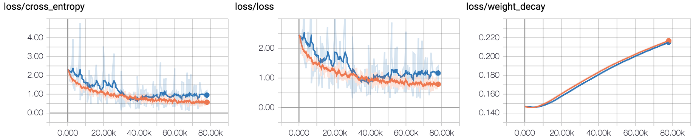

# Training for Basic Classification

This tutorial covers training a neural network model on a GPU server to classify images of 10 objects in the [CIFAR-10](https://www.cs.toronto.edu/~kriz/cifar.html) dataset.


## Preparation

The CIFAR-10 dataset is available from the official website. However, the dataset's original format (numpy array) is unsupported in Blueoil.

Blueoil supports 2 formats for basic classification:

- Caltech101 format
- DeLTA-Mark format

Note: *Please see the details in <a href="../usage/dataset.html">Prepare training dataset</a>*


You can download PNG format CIFAR-10 from our mirror site.
[https://s3-ap-northeast-1.amazonaws.com/leapmind-public-storage/datasets/cifar.tgz](https://s3-ap-northeast-1.amazonaws.com/leapmind-public-storage/datasets/cifar.tgz)

    $ wget https://s3-ap-northeast-1.amazonaws.com/leapmind-public-storage/datasets/cifar.tgz
    $ tar xzf cifar.tgz

The subdirectories of train and test represent the classes. The respective images are located in the aforementioned subdirectories. (The organization is the same for the Caltech101 format.)
```
cifar
 ├─ train
 │   ├─ airplane
 │   │    ├─ xxxx_airplane.png
 │   │    ├─ yyyy_airplane.png
 │   │    ...
 │   ├─ automobile
 │   │    ├─ ...
 │   ├─ bird
 │   │    ├─ ...
 │   ├─ ...
 │   └─ truck
 │        ├─ ...
 └─ test
     ├─ airplane
     │    ├─ ...
     ├─ ...
     ...
```

The CIFAR-10 dataset consists of 60,000 32x32 color images split into 10 classes, with 6,000 images per class. There are 50,000 training images and 10,000 test images.

## Generate a configuration file

Generate your model configuration file interactively by running the `blueoil init` command.

    $ docker run --rm -it \
        -v $(pwd)/cifar:/home/blueoil/cifar \
        -v $(pwd)/config:/home/blueoil/config \
        blueoil_$(id -un):{TAG} \
        blueoil init -o config/cifar10_test.py

The `{TAG}` value must be set to a value like `v0.20.0-11-gf1e07c8` that can be obtained with the `docker images` command.
This value depends on your environment.

Below is an example configuration.

```
#### Generate config ####
  your model name ():  cifar10_test
  choose task type:  classification
  choose network:  LmnetV1Quantize
  choose dataset format:  Caltech101
  training dataset path:  /home/blueoil/cifar/train/
  set validation dataset? (if answer no, the dataset will be separated for training and validation by 9:1 ratio.):  yes
  validataion dataset path:  /home/blueoil/cifar/test/
  batch size (integer):  64
  image size (integer x integer):  32x32
  how many epochs do you run training (integer):  100
  select optimizer:  Momentum
  initial learning rate:  0.001
  choose learning rate schedule ({epochs} is the number of training epochs you entered before):  '3-step-decay' -> learning rate decrease by 1/10 on {epochs}/3 and {epochs}*2/3 and {epochs}-1
  enable data augmentation?  (Y/n):  Yes
  Please choose augmentors:  done (5 selections)
-> select Brightness, Color, FlipLeftRight, Hue, SSDRandomCrop
  apply quantization at the first layer? (Y/n):  no 
```

- Model name: (Any)
- Task type: classification
- Network: LmnetV1Quantize / LmnetV0Quantize
- Dataset format: Caltech101
- Dataset path:
    - Training: {dataset_dir on docker container}/cifar/train/
    - Validation: {dataset_dir on docker container}/cifar/test/
- Batch size: (Any)
- Image size: 32x32
- Number of epoch: (Any number)
- Optimizer:  Momentum
- Initial learning rate: 0.001
- Learning rate schedule: 3-step-decay
- Enable data augmentation:  Yes
- Augmentors: (Random)
- Quantization on the first layer: No

If configuration finishes, the configuration file is generated in the `cifar10_test.py` under config directory.

## Train a neural network

Train your model by running `blueoil train` with model configuration.

    $ docker run --rm \
        -e CUDA_VISIBLE_DEVICES=0 \
        -v $(pwd)/cifar:/home/blueoil/cifar \
        -v $(pwd)/config:/home/blueoil/config \
        -v $(pwd)/saved:/home/blueoil/saved \
        blueoil_$(id -un):{TAG} \
        blueoil train -c config/cifar10_test.py

Just like init, set the value of `{TAG}` to the value obtained by `docker images`.
Change the value of `CUDA_VISIBLE_DEVICES` according to your environment.

When training has started, the training log and checkpoints are generated under `./saved/{MODEL_NAME}`.
The value of `{MODEL_NAME}` will be `{Configuration file}_{TIMESTAMP}`.

Training runs on TensorFlow backend. So you can use TensorBoard to visualize your training process.

    $ docker run --rm \
        -p 6006:6006 \
        -v $(pwd)/saved:/home/blueoil/saved \
        blueoil_$(id -un):{TAG} \
        tensorboard --logdir=saved/{MODEL_NAME}

- Loss / Cross Entropy, Loss, Weight Decay



- Metrics / Accuracy


## Convert training result to FPGA ready format.

Convert trained model to executable binary files for x86, ARM, and FPGA.
Currently, conversion for FPGA only supports Intel Cyclone® V SoC FPGA.

    $ docker run --rm \
        -e CUDA_VISIBLE_DEVICES=0 \
        -e OUTPUT_DIR=/home/blueoil/saved \
        -v $(pwd)/saved:/home/blueoil/saved \
        blueoil_$(id -un):{TAG} \
        blueoil convert -e {MODEL_NAME}
    

`blueoil convert` automatically executes some conversion processes.
- Converts Tensorflow checkpoint to protocol buffer graph.
- Optimizes graph.
- Generates source code for executable binary.
- Compiles for x86, ARM and FPGA.

If conversion is successful, output files are generated under `./saved/{MODEL_NAME}/export/save.ckpt-{Checkpoint No.}/{Image size}/output`.

```
output
 ├── fpga (include preloader and FPGA configuration file)
 │   ├── preloader-mkpimage.bin
 │   ├── soc_system.rbf
 │   └── soc_system.dtb
 ├── models
 │   ├── lib (include trained model library)
 │   │   ├── libdlk_arm.so
 │   │   ├── libdlk_fpga.so
 │   │   └── libdlk_x86.so
 │   └── meta.yaml (model configuration)
 ├── python
 │   ├── lmnet (include pre-process/post-process)
 │   ├── README.md
 │   ├── requirements.txt
 │   ├── run.py (inference script)
 │   └── usb_camera_demo.py (demo script for object detection and classification)
 └── README.md
```

## Run inference script on x86 Linux (Ubuntu 16.04)

- Prepare inference images (not included in the training dataset)

    [ for example: airplane ]
    


- Run inference script

    Explore into the `output/python` directory, and
    run `run.py`. Inference result is saved in `./output/output.json`.

    Note: If you run the script for the first time, you have to setup a python environment (2.7 or 3.5+) and install the required python packages.

      $ cd {output/python directory}
      $ sudo pip install -r requirements.txt  # only the first time
      $ python run.py \
          -i {inference image path} \
          -m ../models/lib/libdlk_x86.so \
          -c ../models/meta.yaml

- Check inference result. Should look like the example below.

      {
          "classes": [
              { "id": 0, "name": "airplane" },
              { "id": 1, "name": "automobile" },
              ...
              { "id": 9, "name": "truck" }
          ],
          "date": "yyyy-mm-ddThh:mm:ss.nnnnnnn",
          "results": [
              {
                  "file_path": "{inference image path}",
                  "prediction": [
                      {
                          "class": { "id": 0, "name": "airplane" },
                          "probability": "0.95808434"
                      },
                      {
                          "class": { "id": 1, "name": "automobile" },
                          "probability": "0.0007377896"
                      },
                      ...
                      {
                          "class": { "id": 9, "name": "truck" },
                          "probability": "0.008015169"
                      }
                  ]
              }
          ],
          "task": "IMAGE.CLASSIFICATION",
          "version": 0.2
      }
