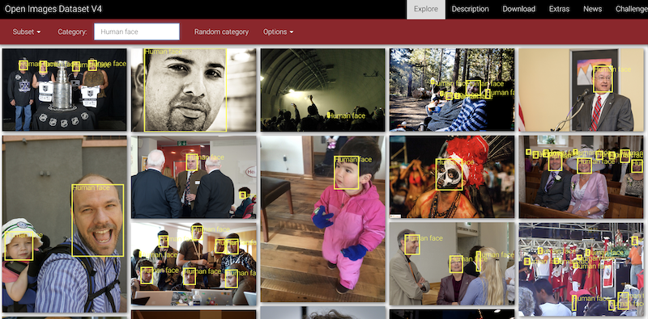
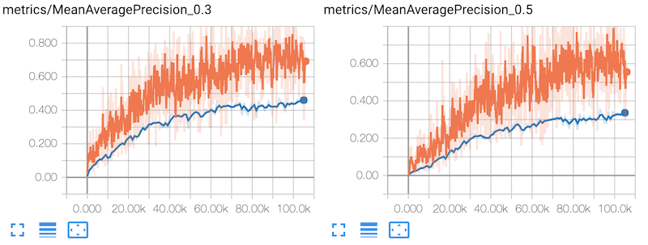
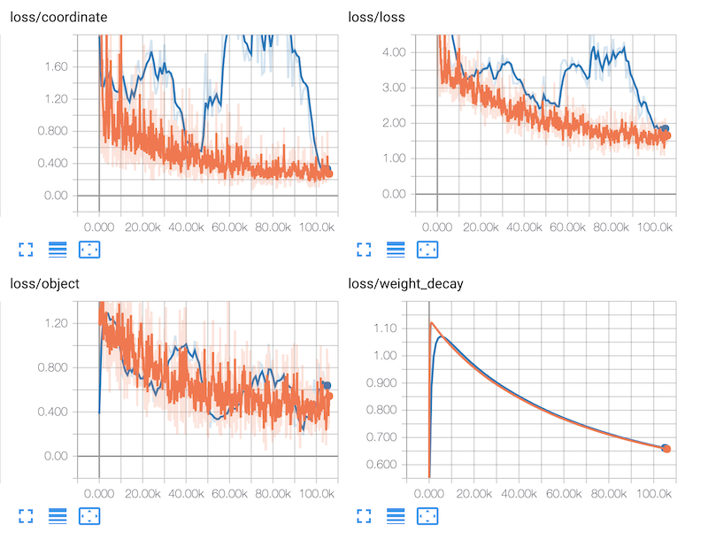
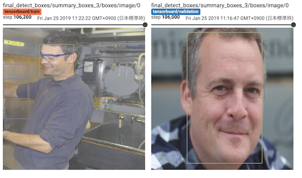

# Training for Object Detection

This tutorial covers training a neural network model on a GPU server to perform object detection of Human Faces in the [Open Images Dataset V4](https://storage.googleapis.com/openimages/web/index.html).



## Preparation

The Open Images V4 dataset is available from the official website, however it is too large for this tutorial. So we provide a reduced dataset.

Blueoil supports 2 formats for object detection.

- OpenImagev4 format
- DeLTA-Mark format

Note: *Please see the details in <a href="../usage/dataset.html">Prepare training dataset</a>*

You can download a subset of Open Images V4 from:
[our server](https://s3-ap-northeast-1.amazonaws.com/leapmind-public-storage/datasets/openimages_face.tgz).


	$ wget https://s3-ap-northeast-1.amazonaws.com/leapmind-public-storage/datasets/openimages_face.tgz
	$ tar xf openimages_face.tgz


This dataset consists of 2866 Human Face images and 5170 annotation boxes.

## Generate a configuration file

Generate your model configuration file interactively by running the `blueoil init` command.

    $ docker run --rm -it \
	    -v $(pwd)/openimages_face:/home/blueoil/openimages_face \
	    -v $(pwd)/config:/home/blueoil/config \
	    blueoil_$(id -un):{TAG} \
	    blueoil init -o config/objectdetection.py

The `{TAG}` value must be set to a value like `v0.20.0-11-gf1e07c8` that can be obtained with the `docker images` command.
This value depends on your environment.

Below is an example of initialization.

```
#### Generate config ####
your model name ():  objectdetection
choose task type:  object_detection
choose network:  LMFYoloQuantize
choose dataset format:  OpenImagesV4
training dataset path:  /home/blueoil/openimages_face/
set validation dataset? (if answer no, the dataset will be separated for training and validation by 9:1 ratio.):  yes
validation dataset path:  /home/blueoil/openimages_face/
batch size (integer):  16
image size (integer x integer):  224x224
how many epochs do you run training (integer):  1000
select optimizer:  Adam
initial learning rate:  0.001
choose learning rate schedule ({epochs} is the number of training epochs you entered before):  '3-step-decay' -> learning rate decrease by 1/10 on {epochs}/3 and {epochs}*2/3 and {epochs}-1
enable data augmentation?  (Y/n):  Yes
Please choose augmentors:  done (5 selections)
-> select Brightness, Color, FlipLeftRight, Hue, SSDRandomCrop
apply quantization at the first layer? (Y/n):  no
```

If configuration finishes, the configuration file is generated in the `objectdetection.py` under config directory.

## Train a network model

Train your model by running `blueoil train` with a model configuration.

	$ docker run --rm \
	    -e CUDA_VISIBLE_DEVICES=0 \
	    -v $(pwd)/openimages_face:/home/blueoil/openimages_face \
	    -v $(pwd)/config:/home/blueoil/config \
	    -v $(pwd)/saved:/home/blueoil/saved \
	    blueoil_$(id -un):{TAG} \
	    blueoil train -c config/objectdetection.py

Just like init, set the value of `{TAG}` to the value obtained by `docker images`.
Change the value of `CUDA_VISIBLE_DEVICES` according to your environment.

When training has started, the training log and checkpoints are generated under `./saved/{MODEL_NAME}`.
The value of `{MODEL_NAME}` will be `{Configuration file}_{TIMESTAMP}`.

Training runs on the TensorFlow backend. So you can use TensorBoard to visualize your training process.

    $ docker run --rm \
	    -p 6006:6006 \
	    -v $(pwd)/saved:/home/blueoil/saved \
	    blueoil_$(id -un):{TAG} \
	    tensorboard --logdir=saved/{MODEL_NAME}

- Metrics / Accuracy


- Loss, Weight Decay


- Images / Final Detect Boxes



## Convert training result to FPGA ready format.

Convert trained model to executable binary files for x86, ARM, and FPGA.
Currently, conversion for FPGA only supports Intel Cyclone® V SoC FPGA.

    $ docker run --rm \
	    -e CUDA_VISIBLE_DEVICES=0 \
	    -e OUTPUT_DIR=/home/blueoil/saved \
	    -v $(pwd)/saved:/home/blueoil/saved \
	    blueoil_$(id -un):{TAG} \
	    blueoil convert -e {MODEL_NAME}

`blueoil convert` automatically executes some conversion processes.
- Converts Tensorflow checkpoint to protocol buffer graph.
- Optimizes graph.
- Generates source code for executable binary.
- Compiles for x86, ARM and FPGA.

If conversion is successful, output files are generated under `./saved/{MODEL_NAME}/export/save.ckpt-{Checkpoint No.}/{Image size}/output`.

```
output
 ├── fpga (include preloader and FPGA configuration file)
 │   ├── preloader-mkpimage.bin
 │   ├── soc_system.rbf
 │   └── soc_system.dtb
 ├── models
 │   ├── lib (include trained model library)
 │   │   ├── libdlk_arm.so
 │   │   ├── libdlk_fpga.so
 │   │   └── libdlk_x86.so
 │   └── meta.yaml (model configuration)
 ├── python
 │   ├── lmnet (include pre-process/post-process)
 │   ├── README.md
 │   ├── requirements.txt
 │   ├── run.py (inference script)
 │   └── usb_camera_demo.py (demo script for object detection)
 └── README.md
```

## Run inference script on x86 Linux (Ubuntu 16.04)

- Prepare images for inference (not included in the training dataset)

	You can find test imgaes on [Creative Commons](https://ccsearch.creativecommons.org/). [Sample](https://ccsearch.creativecommons.org/photos/ddfd33a6-140f-49a3-85b8-3bf58a877990)

		$ wget https://farm4.staticflickr.com/1172/1144309435_eff42ee683_o.jpg

- Run the inference script.

    Explore into the `output/python` directory, and
    run `run.py` and the inference result is saved in `./output/output.json`.

    Note: If you run the script for the first time, you have to setup a python environment (2.7 or 3.5+) and required python packages.

	```
	$ cd {output/python directory}
	$ sudo pip install -r requirements.txt  # for the first time only
	$ python run.py \
	      -i {inference image path} \
	      -m ../models/lib/libdlk_x86.so \
	      -c ../models/meta.yaml
	```

	*Tips:* The default thredhold for object detection is `0.05`. If you find too many boxses when running demo, you can edit `meta.yml` and set threshold to 0.4 or 0.5 as below code.

	```
	ExcludeLowScoreBox:
	    threshold: 0.4
	```

- Check inference results. An example output file is shown below.

	```
	{
	    "classes": [
	        {
	            "id": 0,
	            "name": "Humanface"
	        }
	    ],
	    "date": "2019-01-25T13:15:00.928639",
	    "results": [
	        {
	            "file_path": "{inference_image_path}",
	            "prediction": [
	                {
	                    "box": [
	                        1151.0905382973808,
	                        413.834205695561,
	                        836.2847709655762,
	                        1097.0762968063354
	                    ],
	                    "class": {
	                        "id": 0,
	                        "name": "Humanface"
	                    },
	                    "score": "0.8219463229179382"
	                }
	            ]
	        }
	    ],
	    "task": "IMAGE.OBJECT_DETECTION",
	    "version": 0.2
	}
	```
