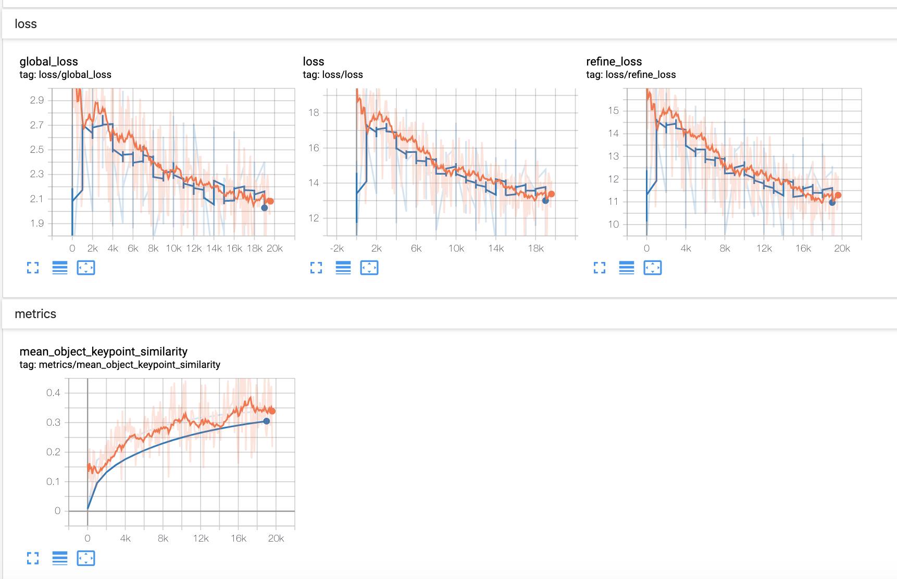
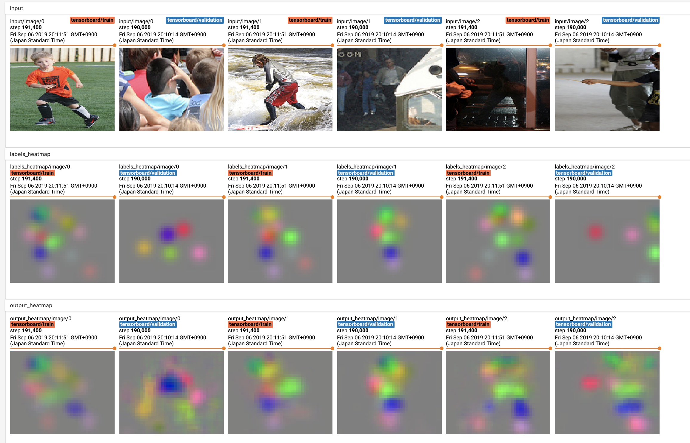
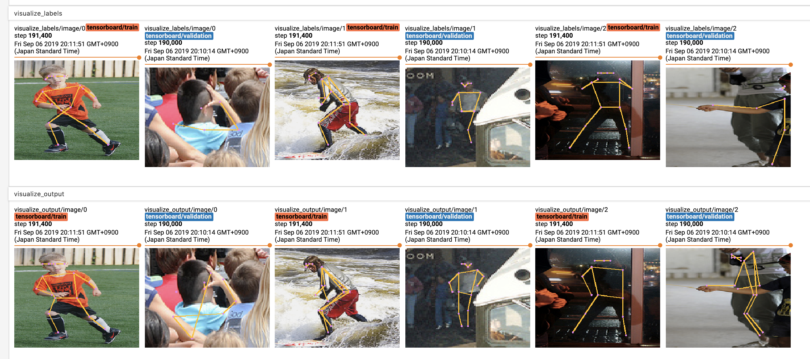

# Training for Keypoint Detection

This tutorial covers training a neural network model on a GPU server to perform keypoint detection.
Specifically, we will train a single-person pose estimation model.

## Preparation

### Dataset

The COCO dataset is available from the official website.
Although COCO dataset is for multi-person pose estimation challenge track.
We customize this dataset to train a single-person pose estimation task.

Blueoil supports 2 formats for keypoint detection.
- MSCOCO format
- YouTube Faces format

For details, please refer to **MSCOCO_2017 keypoint detection** section in <a href="../usage/dataset.html">Prepare training dataset</a>

## Generate a configuration file

Note: Below instructions assume your current path is blueoil root path and the MSCOCO_2017 dataset is successfully at `/storage/dataset/MSCOCO_2017`. .

Generate your model configuration file interactively by running the `blueoil init` command.

    $ docker run --rm -it \
        -v /storage/dataset/MSCOCO_2017:/home/blueoil/MSCOCO_2017 \
        -v $(pwd)/config:/home/blueoil/config \
        blueoil_$(id -un):{TAG} \
        blueoil init -o config/keypoint_detection_demo.py

The `{TAG}` value must be set to a value like `v0.20.0-11-gf1e07c8` that can be obtained with the `docker images` command.
This value depends on your environment.

Below is an example of initialization.

```
#### Generate config ####
your model name ():  keypoint_detection_demo
choose task type:  keypoint_detection
choose network:  LmSinglePoseV1Quantize
choose dataset format:  Mscoco for Single-Person Pose Estimation
training dataset path:  /home/blueoil/MSCOCO_2017/
set validation dataset? (if answer no, the dataset will be separated for training and validation by 9:1 ratio.):  yes
validation dataset path:  /home/blueoil/MSCOCO_2017/
batch size (integer):  4
image size (integer x integer):  160x160
how many epochs do you run training (integer):  100
select optimizer:  Adam
initial learning rate:  0.001
choose learning rate schedule ({epochs} is the number of training epochs you entered before):  '3-step-decay-with-warmup' -> warmup learning rate 1/1000 in first epoch, then train the same way as '3-step-decay'
enable data augmentation? (Y/n):  Yes
Please choose augmentors:  done (6 selections)
-> select Blue, Brightness, Color, Contrast, FlipLeftRight, Hue
apply quantization at the first layer? (Y/n):  no
```

If configuration finishes, the configuration file is generated in the `keypoint_detection_demo.py` under config directory.

## Train a network model

Train your model by running `blueoil train` with a model configuration.

    $ docker run --rm \
        -e CUDA_VISIBLE_DEVICES=0 \
        -e DATA_DIR=/home/blueoil \
        -e OUTPUT_DIR=/home/blueoil/saved \
        -v /storage/dataset/MSCOCO_2017:/home/blueoil/MSCOCO_2017 \
        -v $(pwd)/config:/home/blueoil/config \
        -v $(pwd)/saved:/home/blueoil/saved \
        blueoil_$(id -un):{TAG} \
        blueoil train -c config/keypoint_detection_demo.py

Just like init, set the value of `{TAG}` to the value obtained by `docker images`.
Change the value of `CUDA_VISIBLE_DEVICES` according to your environment.

When training has started, the training log and checkpoints are generated under `./saved/{MODEL_NAME}`.
The value of `{MODEL_NAME}` will be `{Configuration file}_{TIMESTAMP}`.

Training runs on the TensorFlow backend. So you can use TensorBoard to visualize your training process.

    $ docker run --rm \
        -p 6006:6006 \
        -v $(pwd)/saved:/home/blueoil/saved \
        blueoil_$(id -un):{TAG} \
        tensorboard --logdir=saved/{MODEL_NAME}

- loss / metrics


Note: loss consists of global_loss and refine_loss.
global_loss is for all keypoints, refine_loss is for some difficult keypoints.

- input / labels_heatmap / output_heatmap


- visualize_labels, visualize_output



## Convert training result to FPGA ready format.

Convert trained model to executable binary files for x86, ARM, and FPGA.
Currently, conversion for FPGA only supports Intel Cyclone® V SoC FPGA.

    $ docker run --rm \
        -e CUDA_VISIBLE_DEVICES=0 \
        -e OUTPUT_DIR=/home/blueoil/saved \
        -v $(pwd)/saved:/home/blueoil/saved \
        blueoil_$(id -un):{TAG} \
        blueoil convert -e {MODEL_NAME}

`blueoil convert` automatically executes some conversion processes.
- Converts Tensorflow checkpoint to protocol buffer graph.
- Optimizes graph.
- Generates source code for executable binary.
- Compiles for x86, ARM and FPGA.

If conversion is successful, output files are generated under
`./saved/{MODEL_NAME}/export/save.ckpt-{Checkpoint No.}/{Image size}/output`.

```
output
├── fpga
│   ├── preloader-mkpimage.bin
│   ├── soc_system.dtb
│   └── soc_system.rbf
├── models
│   ├── lib
│   │   ├── libdlk_aarch64.so
│   │   ├── libdlk_arm.so
│   │   ├── libdlk_aarch64.a
│   │   ├── libdlk_arm.a
│   │   ├── libdlk_fpga.a
│   │   ├── libdlk_x86.a
│   │   ├── libdlk_fpga.so
│   │   ├── libdlk_x86.so
│   │   ├── lm_aarch64.elf
│   │   ├── lm_arm.elf
│   │   ├── lm_fpga.elf
│   │   └── lm_x86.elf
│   ├── meta.yaml
│   └── minimal_graph_with_shape.pb
├── python
│   ├── lmnet
│   │   ├── common.py
│   │   ├── data_augmentor.py
│   │   ├── data_processor.py
│   │   ├── __init__.py
│   │   ├── nnlib.py
│   │   ├── post_processor.py
│   │   ├── pre_processor.py
│   │   ├── tensorflow_graph_runner.py
│   │   ├── utils
│   │   │   ├── box.py
│   │   │   ├── config.py
│   │   │   ├── demo.py
│   │   │   ├── image.py
│   │   │   ├── __init__.py
│   │   │   └── output.py
│   │   └── visualize.py
│   ├── motion_jpeg_server_from_camera.py
│   ├── README.md
│   ├── requirements.txt
│   ├── run.py
│   └── usb_camera_demo.py
└── README.md
```

## Run inference script on x86 Linux (Ubuntu 16.04)

- Prepare images for inference (not included in the training dataset)

	You can find test imgaes on [Creative Commons](https://ccsearch.creativecommons.org/).
	[Sample](https://ccsearch.creativecommons.org/photos/1a9d20a0-d061-456d-af11-b8753bd46f47)

		$ wget https://live.staticflickr.com/4117/4881737773_0e3ab67b6f_b.jpg

- Run the inference script.

    Explore into the `output/python` directory, and
    run `run.py` and the inference result is saved in `./output/output.json`.

    Note: If you run the script for the first time, you have to setup a python environment (2.7 or 3.5+) and required python packages.

	```
	$ cd {output/python directory}
	$ sudo pip install -r requirements.txt  # for the first time only
	$ python run.py \
	      -i {inference image path} \
	      -m ../models/lib/libdlk_x86.so \
	      -c ../models/meta.yaml
	```

	*Tips:* The default confidence_threshold for keypoint detection is `0.1`.
	If only a part of a human body is in inference_image, but there are some redundant keypoints visulized.
	Please consider enlarging this value in `output/models/meta.yaml`.

	```
	POST_PROCESSOR:
    - GaussianHeatmapToJoints:
        confidence_threshold: 0.1
	```

- Check inference results. An example output file is shown below.

```
{
    "benchmark": {
        "inference": 0.12950640000000008,
        "post": 0.002501737000000004,
        "pre": 0.001524048,
        "total": 0.13353218500000008
    },
    "classes": [
        {
            "id": 0,
            "name": "person"
        }
    ],
    "date": "2019-12-17T08:54:58.835100+00:00",
    "results": [
        {
            "file_path": "4881737773_0e3ab67b6f_b.jpg",
            "prediction": {
                "joints": [
                    308,
                    376,
                    376,
                    274,
                    239,
                    376,
                    274,
                    479,
                    ...
                ]
            }
        }
    ],
    "task": "IMAGE.KEYPOINT_DETECTION",
    "version": 0.2
}
```
