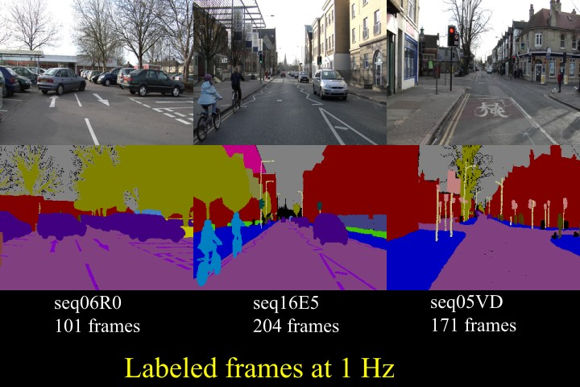
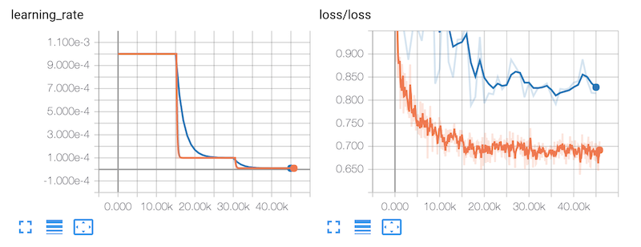
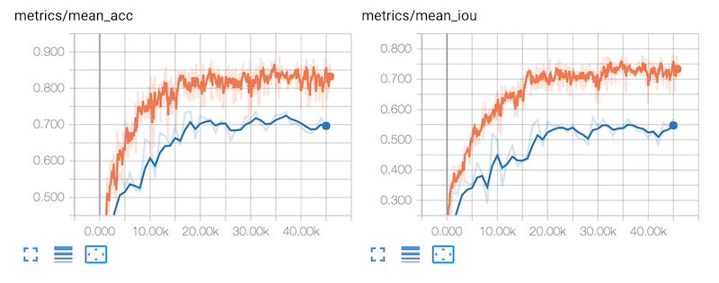
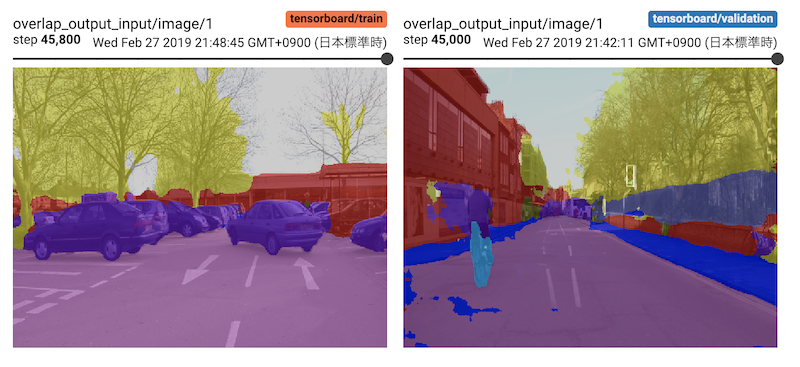
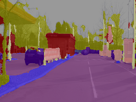

# Training for Semantic Segmentation

This guide covers training a neural network model on a GPU server to perferm semantic segmentation of on the [CamVid](http://mi.eng.cam.ac.uk/research/projects/VideoRec/CamVid/) dataset.



## Preparation

The CamVid dataset is available from the SegNet tutorial on [Github](https://github.com/alexgkendall/SegNet-Tutorial), but the dataset contains fixed absolute paths of the data like [`/SegNet/CamVid/test/0001TP_008550.png`](https://github.com/alexgkendall/SegNet-Tutorial/blob/master/CamVid/test.txt). We have changed the absolute paths to relative paths. You can download out modified dataset from our mirror site.

```
$ wget https://s3-ap-northeast-1.amazonaws.com/leapmind-public-storage/datasets/camvid.tgz
$ tar -xzf camvid.tgz
```

The directory structure of this dataset is shown below. In the CamVid dataset, both training and annotation data are binary image files.

```
CamVid
 ├─ label_colors.txt
 │
 ├─ train.txt
 ├─ train
 │   ├─ 0001TP_006690.png
 │   ├─ 0001TP_007500.png
 │   └─ ...
 ├─ trainannot
 │   ├─ 0001TP_006690.png
 │   ├─ 0001TP_007500.png
 │   └─ ...
 │
 ├─ val.txt
 ├─ val
 │   ├─ 0016E5_07959.png
 │   ├─ 0016E5_07975.png
 │   └─ ...
 ├─ valannot
 │   ├─ 0016E5_07959.png
 │   ├─ 0016E5_07975.png
 │   └─ ...
 │
 ├─ test.txt
 ├─ test
 │   ├─ 0001TP_008550.png
 │   ├─ 0001TP_008910.png
 │   └─ ...
 └─ testannot
     ├─ 0001TP_008550.png
     ├─ 0001TP_008910.png
     └─ ...
```

CamVid dataset consists of 360x480 color images in 12 classes. There are 367 training images, 101 validaton images and 233 test images.

## Generate a configuration file

Generate your model configuration file interactively by running the `blueoil init` command.

    $ docker run --rm -it \
        -v $(pwd)/CamVid:/home/blueoil/CamVid \
	    -v $(pwd)/config:/home/blueoil/config \
	    blueoil_$(id -un):{TAG} \
	    blueoil init -o config/camvid.py


The `{TAG}` value must be set to a value like `v0.20.0-11-gf1e07c8` that can be obtained with the `docker images` command.
This value depends on your environment.

Below is an example of initialization.


```
#### Generate config ####
your model name ():  camvid
choose task type:  semantic_segmentation
choose network:  LmSegnetV1Quantize
choose dataset format:  CamvidCustom
training dataset path:  /home/blueoil/CamVid/
set validation dataset? (if answer no, the dataset will be separated for training and validation by 9:1 ratio.):  yes
test dataset path:  /home/blueoil/CamVid/
batch size (integer):  8
image size (integer x integer):  360x480
how many epochs do you run training (integer):  1000
choose optimizer: Adam
initial learning rate:  0.001
choose learning rate schedule ({epochs} is the number of training epochs you entered before):  '3-step-decay' -> learning rate decrease by 1/10 on {epochs}/3 and {epochs}*2/3 and {epochs}-1
enable data augmentation?  (Y/n):  Yes
Please choose augmentors:  done (5 selections)
-> select Brightness, Color, Contrast, FlipLeftRight, Hue
apply quantization at the first layer? (Y/n):  no
```

If configuration finishes, the configuration file is generated in the `camvid.py` under config directory.

## Train a network model

Train your model by running `blueoil train` command with model configuration.

    $ docker run --rm \
	    -e CUDA_VISIBLE_DEVICES=0 \
	    -v $(pwd)/CamVid:/home/blueoil/CamVid \
	    -v $(pwd)/config:/home/blueoil/config \
	    -v $(pwd)/saved:/home/blueoil/saved \
	    blueoil_$(id -un):{TAG} \
	    blueoil train -c config/camvid.py

Just like init, set the value of `{TAG}` to the value obtained by `docker images`.
Change the value of `CUDA_VISIBLE_DEVICES` according to your environment.

When training has started, the training log and checkpoints are generated under `./saved/{MODEL_NAME}`.
The value of `{MODEL_NAME}` will be `{Configuration file}_{TIMESTAMP}`.

Training runs on the TensorFlow backend. So you can use TensorBoard to visualize your training progress.

    $ docker run --rm \
	    -p 6006:6006 \
	    -v $(pwd)/saved:/home/blueoil/saved \
	    blueoil_$(id -un):{TAG} \
	    tensorboard --logdir=saved/{MODEL_NAME}

- Learning Rate / Loss


- Metrics / IOU


- Images / Overlap Output Input


## Convert training result to FPGA ready format.

Convert trained model to executable binary files for x86, ARM, and FPGA.
Currently, conversion for FPGA only supports Intel Cyclone® V SoC FPGA.

    $ docker run --rm \
	    -e CUDA_VISIBLE_DEVICES=0 \
	    -e OUTPUT_DIR=/home/blueoil/saved \
	    -v $(pwd)/saved:/home/blueoil/saved \
	    blueoil_$(id -un):{TAG} \
	    blueoil convert -e {MODEL_NAME}

`blueoil convert` automatically executes some conversion processes.
- Convert Tensorflow checkpoint to protocol buffer graph.
- Optimize graph
- Generate source code for executable binary
- Compile for x86, ARM and FPGA

If conversion is successful, output files are generated under `./saved/{MODEL_NAME}/export/save.ckpt-{Checkpoint No.}/{Image size}/output`.

```
output
 ├── fpga (include preloader and FPGA configuration file)
 │   ├── preloader-mkpimage.bin
 │   ├── soc_system.rbf
 │   └── soc_system.dtb
 ├── models
 │   ├── lib (include trained model library)
 │   │   ├── libdlk_arm.so
 │   │   ├── libdlk_fpga.so
 │   │   └── libdlk_x86.so
 │   └── meta.yaml (model configuration)
 ├── python
 │   ├── lmnet (include pre-process/post-process)
 │   ├── README.md
 │   ├── requirements.txt
 │   ├── run.py (inference script)
 │   └── usb_camera_demo.py (demo script for object detection and classification)
 └── README.md
```

## Run inference script on x86 Linux (Ubuntu 16.04)

- Prepare images for inference

	You can find test imgaes on CamVid's [Official Site](http://mi.eng.cam.ac.uk/research/projects/VideoRec/CamVid/).

		$ wget http://mi.eng.cam.ac.uk/research/projects/VideoRec/CamVid/pr/0006R0_f02040.jpg

- Run inference script

    Explore into the `output/python` directory, and
    run `run.py`. Inference results are saved in `./output/images/{image_name}.png`.

    Note: If you run the script for the first time, you have to setup a python environment (2.7 or 3.5+) and required python packages.

	```
	$ cd {output/python directory}
	$ sudo pip install -r requirements.txt  # for the first time only
	$ python run.py \
	      -i {inference image path} \
	      -m ../models/lib/libdlk_x86.so \
	      -c ../models/meta.yaml
	```

- Check inference results

	Image will be exported to `output/images/{image_name}.png`. Below you can see an example of the expected output.

	
